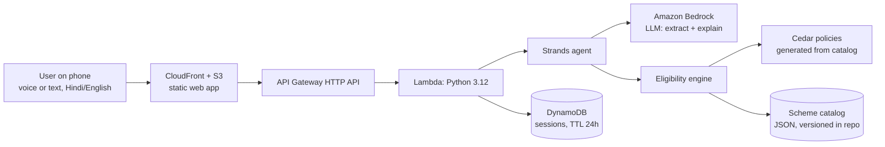

# Haqdaar — Build Specification

> **Read this first (instructions to the coding agent).**
> You are building this project end-to-end for a hackathon with a hard deadline. Work through the milestones in Section 15 **in order**. Commit to Git after every milestone (small, meaningful commit messages). Prefer a working, deployed, simple feature over an ambitious unfinished one. Never invent government-scheme rules: all rules come from the seed catalog in Section 7 and are marked PROVISIONAL until a human verifies them. If something in this document is ambiguous, choose the simplest interpretation, note the assumption in `DECISIONS.md`, and continue. Do not stop to ask questions unless a required credential or permission is missing.

---

## 1. Product summary

**Haqdaar** ("rightful claimant") is a mobile-first web app that audits a whole family's eligibility for Indian government schemes.

A person describes their family in Hindi or English, by voice or text. Haqdaar:

1. Extracts a structured family profile from the conversation (AI).
2. Decides eligibility for each scheme and each family member using a **deterministic rules engine** (Cedar policies), never the LLM.
3. Shows three buckets: **Eligible now**, **One step away** (with the exact step, e.g. "open a Jan Dhan account" or "eligible when you turn 70, in 2 years"), and **Check officially** (schemes that can't be decided from self-reported data).
4. Generates a printable **Benefits Pack**: per-scheme benefit, documents checklist, where and how to apply.

**One-line pitch:** *"Millions of families miss benefits they're entitled to because nobody tells them. Haqdaar tells them in their own language, and never guesses."*

**Core design principle:** The LLM extracts facts and explains results. It never decides eligibility. Every eligibility result is traceable to a specific rule with a source and a "last verified" date.

## 2. Hackathon context and constraints

- Event: First Commit (WeMakeDevs x AWS, Bharat Builds Tour), online Sept 17 to 20, 2026.
- Judging: (1) Idea and Impact, (2) Built on AWS (mandatory: must use AWS services or AWS open-source projects), (3) Learning shown, (4) Execution (it works), (5) 3-minute recorded demo video (no live demo).
- Target track: **Ship It** (deployed on AWS with a public URL). Also eligible for Best UI, so the mobile UI quality matters.
- Everything must be buildable and deployable in roughly **one day**. Scope ruthlessly (Section 4).
- Must run on AWS Free Tier credits. Keep cost low: small Lambda memory, DynamoDB on-demand, short LLM prompts, API throttling.

## 3. Users and scenarios

**Primary user:** an adult in a low-to-middle-income Indian household (rural or urban) who is more comfortable in Hindi, on an Android phone, and who currently relies on middlemen or word of mouth to learn about schemes.

**Secondary user:** the volunteer, CSC operator, or NGO worker helping many families.

**Scenario A (hero demo):** Sita, 34, rural Rajasthan. Husband Ramesh (38, farmer with land). Daughter Priya (7). Mother-in-law (68). Household income about ₹1.2 lakh. BPL ration card. No LPG connection. Has a bank account. Nobody pays income tax. She says this in Hindi in under 30 seconds.
Expected: PM-KISAN (Ramesh), pension and insurance schemes for adults, Sukanya Samriddhi (Priya), Ujjwala (Sita), old-age pension (mother-in-law), and a near-miss for the 70+ health cover ("eligible in 2 years").

**Scenario B:** Arjun, 29, urban street vendor, no bank account. Result: street-vendor loan scheme eligible; insurance/pension schemes "one step away: open a Jan Dhan account".

**Scenario C (negative case):** salaried engineer who pays income tax. Result: PM-KISAN "Not eligible: income-tax payer" (shown only if the user expands "Not eligible").

## 4. Scope

**P0 (must ship):**
- Conversational profile capture (text + browser voice input in Hindi/English) via a Strands agent.
- Live "Family Profile" card that updates as facts are extracted.
- Deterministic eligibility engine over the seed catalog with tri-state results (eligible / not eligible / needs info) plus near-miss analysis.
- Results screen with the three buckets and per-scheme detail (documents checklist, steps, verified-on chip).
- Deployed on AWS: frontend on S3 + CloudFront, API on API Gateway + Lambda, data on DynamoDB.
- README with architecture diagram and a "What I learned" section.

**P1 (ship if time allows):**
- Printable Benefits Pack (browser print to PDF).
- No-LLM guided form fallback that calls `/eligibility` directly.
- Hindi read-aloud of results using the browser's `speechSynthesis`.
- Cedar as the authoritative decision layer (fallback: JSON engine, see Section 8).

**P2 (only if everything else is done):**
- Rajasthan state schemes (only after each is verified on an official portal).
- Shareable pack link (DynamoDB item with TTL).
- Amazon Polly for read-aloud.

**Out of scope:** user accounts and login (guest sessions only), payments, real application submission, document upload/OCR, WhatsApp integration, any scraping.

## 5. Architecture



**AWS services used:** CloudFront, S3, API Gateway (HTTP API), Lambda, DynamoDB, Bedrock, IAM, CloudWatch Logs. Open source: Strands Agents SDK, Cedar (via `cedarpy`), AWS SAM CLI.

**Stack:**
- Backend: Python 3.12, Strands Agents SDK, `cedarpy`, `pydantic`, `boto3`.
- Frontend: Vite + React + TypeScript + Tailwind CSS. PWA manifest (installable). No UI framework that looks templated; see Section 10.
- IaC: **AWS SAM** (`template.yaml`) for backend and hosting; a `Makefile` for one-command build and deploy.
- Voice: Browser Web Speech API (`SpeechRecognition` with `hi-IN` / `en-IN`, `speechSynthesis` for read-aloud). Needs Chrome/Android; degrade gracefully to text if unsupported.

## 6. Data model

### 6.1 Family profile (JSON, stored per session)

```json
{
  "household": {
    "state": "Rajasthan",
    "area_type": "rural",
    "annual_income_inr": 120000,
    "ration_card": "bpl",
    "has_pucca_house": false,
    "has_lpg_connection": false,
    "owns_agri_land": true
  },
  "members": [
    {
      "id": "m1",
      "relation": "self",
      "name": "Sita",
      "age": 34,
      "gender": "female",
      "occupation": "homemaker",
      "is_income_tax_payer": false,
      "has_bank_account": true,
      "is_govt_employee_or_pensioner": false
    }
  ]
}
```

**Enums**
- `area_type`: `rural | urban`
- `ration_card`: `none | apl | bpl | aay`
- `gender`: `female | male | other`
- `occupation`: `farmer | street_vendor | artisan | small_business | salaried | homemaker | student | laborer | unemployed | retired | other`

Any field may be `null` (unknown). **Unknown is not false.** The engine must distinguish them.

### 6.2 DynamoDB

- Table `haqdaar-sessions`: PK `session_id` (string). Attributes: `profile` (map), `history` (list, last 10 messages), `lang`, `updated_at`, `ttl` (epoch seconds, now + 24h). Enable TTL on `ttl`. On-demand billing.
- **No personal data is retained beyond 24 hours.** No names are required (relation labels suffice).

## 7. Scheme catalog

Location: `backend/catalog/schemes.json` (array). This is the single source of truth. Cedar policies and UI copy derive from it.

### 7.1 Schema

```json
{
  "id": "apy",
  "scope": "member",
  "decision_mode": "rules",
  "category": "pension",
  "name": {"en": "Atal Pension Yojana", "hi": "अटल पेंशन योजना"},
  "benefit": {"en": "Guaranteed monthly pension after age 60; amount depends on your contribution.", "hi": "..."},
  "criteria": [
    {"field": "age", "op": "gte", "value": 18, "label": {"en": "Age 18 or above", "hi": "..."}, "near_miss": {"kind": "time", "unit": "years", "max_gap": 3}},
    {"field": "age", "op": "lte", "value": 40, "label": {"en": "Age 40 or below", "hi": "..."}},
    {"field": "has_bank_account", "op": "eq", "value": true, "label": {"en": "Has a bank account", "hi": "..."}, "fix": {"en": "Open a zero-balance Jan Dhan / basic savings account", "hi": "..."}},
    {"field": "is_income_tax_payer", "op": "eq", "value": false, "label": {"en": "Not an income-tax payer", "hi": "..."}}
  ],
  "documents": ["aadhaar", "bank_passbook", "mobile_number"],
  "steps": {"en": ["Visit your bank branch or use net banking", "Choose the pension amount", "Set up auto-debit"], "hi": []},
  "apply": {"where": {"en": "Your bank branch or net banking", "hi": "..."}, "url": null},
  "source": {"url": null, "verified_on": null, "status": "PROVISIONAL"},
  "hi_reviewed": false
}
```

**Fields**
- `scope`: `member` (evaluated per person) or `household` (deduplicated to one result per family, showing "via: <member>").
- `decision_mode`: `rules` (engine decides) or `informational` (cannot be decided from self-reported data; shown in **Check officially** with instructions).
- `op`: `eq | neq | gte | lte | gt | lt | in`.
- `near_miss.kind = "time"` (age-based, "eligible in N years") or `"amount"` (numeric threshold, show the gap). Only single-criterion misses within `max_gap` (or a criterion with a `fix`) qualify as **One step away**.
- `source.status`: `PROVISIONAL` | `VERIFIED`. The UI must show a "Rules last verified: <date>" chip, or "Being verified" if `verified_on` is null.
- `hi_reviewed: false` means Hindi copy has not been human-reviewed; the UI may show a subtle "translation being reviewed" note in developer mode only.

### 7.2 Seed schemes (all PROVISIONAL, verify before demo)

Implement these in `schemes.json`. Amounts and rules below are **starting points from general knowledge** and may be outdated or simplified. The builder must never present them as verified. Every entry gets a `TODO(verify)` on the official portal.

| id | scope | mode | criteria (all must hold) | one-step fixes |
|---|---|---|---|---|
| `pm-kisan` | household | rules | occupation = farmer; hh_owns_agri_land = true; is_income_tax_payer = false; is_govt_employee_or_pensioner = false | none |
| `apy` | member | rules | age 18–40; has_bank_account = true; is_income_tax_payer = false | bank account |
| `pmjjby` | member | rules | age 18–50; has_bank_account = true | bank account |
| `pmsby` | member | rules | age 18–70; has_bank_account = true | bank account |
| `sukanya-samriddhi` | member | rules | gender = female; age ≤ 9 (opened by parent/guardian) | none |
| `pmuy` | member | rules | gender = female; age ≥ 18; hh_has_lpg_connection = false; hh_ration_card in [bpl, aay] | none |
| `pm-svanidhi` | member | rules | occupation = street_vendor; age ≥ 18 | none |
| `pm-mudra` | member | rules | occupation in [small_business, street_vendor, artisan]; age ≥ 18 | none |
| `pm-vishwakarma` | member | rules | occupation = artisan; age ≥ 18; is_govt_employee_or_pensioner = false | none |
| `nsap-old-age-pension` | member | rules | age ≥ 60; hh_ration_card in [bpl, aay] | none |
| `ayushman-vay-vandana` | member | rules | age ≥ 70 | none (time near-miss) |
| `pmjay-general` | household | informational | needs official beneficiary-list check | instruct: check name at official portal / CSC |
| `pmay-g` | household | informational | rural housing; needs official list/verification | instruct: contact gram panchayat / official portal |

For each scheme also provide: `benefit` text, `documents` (typically Aadhaar, bank passbook, mobile number, plus scheme-specific such as land records for PM-KISAN, ration card for BPL-linked schemes, birth certificate for Sukanya), `steps`, and `apply.where`.

**Verification task (human, before submission):** for each scheme, open the official portal, confirm the criteria and benefit, set `source.url`, `source.verified_on`, and `source.status = VERIFIED`. Remove or downgrade to `informational` any scheme you cannot verify. Add a repo file `VERIFICATION.md` tracking status per scheme.

## 8. Eligibility engine

### 8.1 Two-layer design

1. **Criteria evaluator (Python):** evaluates each criterion with tri-state result `PASS | FAIL | UNKNOWN`. Produces per-criterion explanations, near-miss and fix suggestions, and the list of missing fields.
2. **Cedar (authoritative gate):** a build script `scripts/build_cedar.py` generates `policies.cedar` from `schemes.json`. At runtime, for every scheme where all needed fields are known, Cedar is asked `is_authorized`. The final `ELIGIBLE` decision requires Cedar allow **and** all criteria PASS. A unit test asserts both layers agree across all fixtures; disagreement fails CI.

Environment flag `ELIGIBILITY_ENGINE=cedar|json` (default `cedar`). If `cedarpy` packaging on Lambda causes problems for more than about an hour, switch the default to `json` (criteria evaluator only) and keep Cedar as a documented, tested optional layer. Do not sink the project on this.

### 8.2 Result statuses per (member, scheme)

- `ELIGIBLE`: all criteria PASS (and Cedar allows).
- `ONE_STEP_AWAY`: exactly one criterion FAILS and it has a `fix`, or a `near_miss` within `max_gap`. Include `blocking_criterion`, `action` (fix text) or `eligible_in_years`.
- `NEEDS_INFO`: no criterion FAILs but at least one is UNKNOWN. Include `missing_fields`.
- `NOT_ELIGIBLE`: at least one FAIL that isn't a near-miss. Include the failing criterion labels.
- `CHECK_OFFICIALLY`: `decision_mode = informational`.

Household-scoped schemes: evaluate per member, then collapse to the best status per household with `via_member` set.

### 8.3 Next-best-question

Function `next_question(profile)` returns the missing field that would resolve the most `NEEDS_INFO` results, weighted toward schemes with `ELIGIBLE` potential. The agent asks exactly this, one question at a time, in the user's language.

### 8.4 Cedar details

- Entity types: `Person` (principal), `Scheme` (resource), action `Action::"claim"`.
- Cedar supports integers, not floats. Store income in whole rupees, ages as integers.
- Flatten household attributes onto the person entity with an `hh_` prefix (`hh_annual_income_inr`, `hh_ration_card`, `hh_has_lpg_connection`, `hh_owns_agri_land`, `hh_area_type`, `hh_has_pucca_house`, `hh_state`).
- Example generated policy:

```cedar
permit (
  principal is Person,
  action == Action::"claim",
  resource == Scheme::"apy"
) when {
  principal.age >= 18 && principal.age <= 40 &&
  principal.has_bank_account == true &&
  principal.is_income_tax_payer == false
};
```

- Set membership: `["bpl","aay"].contains(principal.hh_ration_card)`.
- Check the `cedarpy` README for the exact `is_authorized` call signature (request as entity references, policies as text, entities as JSON list).
- Packaging: build the Lambda with `sam build --use-container` (or install Linux wheels explicitly) so native wheels match Lambda's architecture (use x86_64).

## 9. Agent design (Strands on Lambda)

**Model:** Bedrock, configured by env vars `BEDROCK_MODEL_ID` and `AWS_REGION`. **First task in M0:** write a smoke-test script that invokes the chosen model in the chosen region and records the working `modelId`/region in `.env.example`. Use a cross-region inference profile ID if the region requires it. If Bedrock access is blocked, stop and tell the human what to enable.

**Statelessness:** Lambda is stateless. On each `/chat` call: load session from DynamoDB, rebuild the agent messages from the last 10 stored turns, run one agent turn, save profile and history.

**Tools (Strands `@tool`):**
- `update_profile(household: dict | None, members: list[dict] | None)`: Pydantic-validated merge into the profile. Never overwrites known values with null. Normalizes enums (e.g. "kheti" / "farmer" → `farmer`, "BPL card hai" → `ration_card=bpl`).
- `run_eligibility()`: runs the engine over the current profile and returns the structured results.
- `get_next_question()`: returns the single best missing field and a plain-language description.
- `get_scheme_details(scheme_id)`: returns documents, steps, and apply info from the catalog.

**System prompt (draft; keep it under 400 tokens):**

```
You are Haqdaar, a warm, plain-spoken assistant that helps Indian families find government benefits they may be entitled to.
Rules:
1. Reply in the user's language (Hindi or English; mirror them). Use simple words. Max 60 words per reply.
2. Your job in the conversation: collect facts about the family. Call update_profile every time the user gives facts.
3. Ask ONE question at a time, using get_next_question. Do not interrogate; after at most 6 questions or when the user says that's all, call run_eligibility.
4. NEVER state or imply that someone is or isn't eligible for a scheme from your own knowledge. Only report what run_eligibility returned.
5. Never ask for Aadhaar numbers, phone numbers, bank details, or exact addresses. Names are optional.
6. If unsure what the user meant, ask a short clarifying question instead of guessing.
7. Always remind, once, that final eligibility is confirmed by the official office.
```

**Response contract:** the Lambda returns structured JSON (not text to be parsed): `reply`, `profile`, `missing_fields`, and `results` when the engine ran. The UI renders cards from `results`, never from the reply text.

**Failure handling:** wrap the agent call with a 20-second cap. On timeout or Bedrock error, return `{error: "llm_unavailable"}` and let the UI offer the guided-form fallback (P1) or a retry.

## 10. Frontend specification

**Design direction:** calm, trustworthy, generous. Not a generic chatbot skin. Warm off-white background, deep green primary, saffron accent used sparingly, large type (16px+ base, 20px+ for key numbers), big tap targets (48px+), high contrast. Devanagari must look native: use **Noto Sans Devanagari** (Google Fonts) with a proper fallback stack. Respect `prefers-color-scheme` if cheap; otherwise light only.

**Screens**
1. **Start:** logo, one-line promise, language toggle (हिन्दी / English), a large microphone button, a text input, and 3 tappable example prompts (e.g. "I'm a farmer in Rajasthan with a wife, a 7-year-old daughter and a mother aged 68").
2. **Conversation:** chat on the main area; a **Family Profile** card (collapsible bottom sheet on mobile) showing members as chips with age/occupation and household facts, updating live with a subtle animation. Show typing/"thinking" state. A "See my results" button appears as soon as at least one result is available.
3. **Results:** three tabs: **Eligible now (N)**, **One step away (N)**, **Check officially (N)**. Optional "Not eligible" expander. Each scheme is a card: name, one-line benefit, "for: <member>", and status. Cards show a "Rules last verified" chip.
4. **Scheme detail (bottom sheet or page):** benefit, why-you-qualify (criteria as green ticks), documents checklist (interactive checkboxes), steps, where to apply, official link (if known), and for near-misses the exact action ("Open a Jan Dhan account, then you qualify") or timing ("Eligible in 2 years").
5. **Benefits Pack (P1):** print-optimized page listing eligible and one-step schemes with document checklists. A "Save as PDF" button calls `window.print()`. Print CSS must hide chrome and render Devanagari correctly (browser rendering handles shaping; do **not** use a Python PDF library for Hindi).

**UX requirements**
- Works well at 360px width; usable one-handed.
- Voice: press-to-talk, live transcript in the input, language follows the toggle. If unsupported, hide the mic and show a small note.
- Always visible, unobtrusive disclaimer: "Guidance only. Final eligibility is confirmed by the official office."
- Empty, loading, and error states for every screen. Retry buttons.
- i18n: all UI strings in `frontend/src/i18n/{en,hi}.json`. Scheme text comes from the catalog.
- Accessibility: labels, focus order, `aria-live` for new assistant messages.

## 11. API contract

Base: API Gateway HTTP API, CORS enabled for the CloudFront origin (and `http://localhost:5173` in dev). Apply stage throttling (e.g. rate 5, burst 10) to protect cost.

**`POST /chat`**
```json
// request
{ "session_id": "optional-uuid", "message": "मैं राजस्थान में किसान हूँ...", "lang": "hi" }
// response
{
  "session_id": "uuid",
  "reply": "ठीक है। आपके परिवार में कुल कितने लोग हैं?",
  "profile": { "household": {}, "members": [] },
  "missing_fields": ["hh_annual_income_inr"],
  "results": null
}
```

**`POST /eligibility`** (no LLM; used by the form fallback and tests)
```json
// request
{ "profile": { "household": {}, "members": [] }, "lang": "en" }
// response
{
  "results": [
    {
      "scheme_id": "apy", "member_id": "m2", "status": "ELIGIBLE",
      "why": [{"criterion": "Age 18–40", "result": "PASS"}],
      "blocking": null, "action": null, "eligible_in_years": null,
      "missing_fields": [], "via_member": null
    }
  ],
  "engine": "cedar",
  "catalog_version": "2026-09-20"
}
```

**`GET /schemes`** returns the public catalog fields (id, name, benefit, category, documents, steps, apply, source).

**`GET /health`** returns `{ "ok": true }`.

All errors: `{ "error": "<code>", "message": "<human text>" }` with appropriate HTTP status. Log request IDs, never log message bodies or profile contents.

## 12. Infrastructure (SAM)

`template.yaml` resources:
- `AWS::Serverless::HttpApi` with CORS and throttling.
- `AWS::Serverless::Function` (Python 3.12, x86_64, 1024 MB, timeout 25 s; API Gateway HTTP APIs cap integration time around 30 s) with env vars (`SESSIONS_TABLE`, `BEDROCK_MODEL_ID`, `ELIGIBILITY_ENGINE`) and an IAM policy allowing `bedrock:InvokeModel` (and streaming variant if used) on the specific model/inference-profile ARN, plus DynamoDB read/write on the sessions table.
- `AWS::DynamoDB::Table` on-demand with TTL on `ttl`.
- Frontend hosting: private S3 bucket + CloudFront distribution with Origin Access Control, default root object `index.html`, SPA fallback (403/404 → `/index.html`).
- CloudWatch log retention: 7 days.
- Outputs: `ApiUrl`, `SiteUrl`.

**Deploy sequence (`make deploy`):**
1. `sam build --use-container`
2. `sam deploy --guided` (first time) / `sam deploy` (later)
3. Read `ApiUrl` from stack outputs.
4. `VITE_API_URL=<ApiUrl> npm run build` in `frontend/`
5. `aws s3 sync frontend/dist s3://<bucket> --delete`
6. CloudFront invalidation on `/*`.
7. Print `SiteUrl` and run a smoke test against `/health` and `/eligibility`.

**Local dev (also supports the "Build It" story):** `sam local start-api` for the backend, `npm run dev` for the frontend, and a `MOCK_LLM=1` mode that skips Bedrock so the engine and UI can be developed offline.

## 13. Repository structure

```
haqdaar/
├─ README.md               # problem, architecture diagram, AWS services, live URL, video link, learnings
├─ DECISIONS.md            # assumptions and trade-offs made by the agent
├─ VERIFICATION.md         # per-scheme verification status (human task)
├─ template.yaml           # SAM
├─ Makefile
├─ backend/
│  ├─ app.py               # Lambda handler + routing
│  ├─ agent.py             # Strands agent, tools, prompt
│  ├─ engine/
│  │  ├─ criteria.py       # tri-state evaluator, near-miss, next_question
│  │  ├─ cedar_layer.py    # cedarpy integration
│  │  └─ policies.cedar    # GENERATED, committed
│  ├─ catalog/schemes.json
│  ├─ models.py            # Pydantic models (Profile, Member, Result)
│  ├─ store.py             # DynamoDB session store
│  ├─ requirements.txt
│  └─ tests/
│     ├─ fixtures/         # personas A, B, C, D + expected outputs
│     ├─ test_engine.py
│     └─ test_cedar_agreement.py
├─ scripts/
│  ├─ build_cedar.py
│  └─ bedrock_smoke_test.py
└─ frontend/
   ├─ index.html, vite.config.ts, tailwind.config.ts
   └─ src/ (components, screens, i18n, api client, voice hooks, print.css)
```

## 14. Testing and quality

**Golden fixtures** (expected outcomes are provisional until rules are verified):
- **A (Sita's family):** PM-KISAN via Ramesh = ELIGIBLE; APY for Sita and Ramesh = ELIGIBLE; PMJJBY/PMSBY for adults = ELIGIBLE; Sukanya for Priya = ELIGIBLE; PMUY for Sita = ELIGIBLE; NSAP for mother-in-law (68, BPL) = ELIGIBLE; Vay Vandana for mother-in-law = ONE_STEP_AWAY with `eligible_in_years = 2`; PM-JAY general = CHECK_OFFICIALLY.
- **B (Arjun):** SVANidhi = ELIGIBLE; APY/PMJJBY/PMSBY = ONE_STEP_AWAY (action: open bank account); PM-KISAN = NOT_ELIGIBLE.
- **C (tax-paying salaried engineer):** PM-KISAN = NOT_ELIGIBLE (income-tax payer); APY = NOT_ELIGIBLE.
- **D (72-year-old, sparse profile):** Vay Vandana = ELIGIBLE; schemes needing unknown fields = NEEDS_INFO with correct `missing_fields`.

**Required tests:**
- Engine unit tests per fixture (tri-state handling: unknown must never become fail or pass).
- Cedar/criteria agreement test across all fixtures and randomized profiles (property-style, at least 200 random profiles).
- Profile merge test: `update_profile` never overwrites known values with null.
- One end-to-end smoke test script against the deployed URL.

**Definition of done for each milestone:** tests pass, app runs, changes committed.

## 15. Milestones and priorities

| # | Milestone | Target time | Acceptance |
|---|---|---|---|
| M0 | Repo scaffold, Bedrock smoke test, SAM skeleton, first commit | 0:30 | `bedrock_smoke_test.py` prints a model reply; `sam build` works; committed |
| M1 | Catalog + engine (+ Cedar generation) + fixtures, no LLM | 2:00 | All fixture tests green; `/eligibility` works locally |
| M2 | Strands agent + `/chat` + session store | 2:00 | Hindi and English conversation builds the Scenario A profile; results returned |
| M3 | Frontend: start, chat, live profile, results, scheme detail | 2:30 | Scenario A works end-to-end locally on a 360px viewport |
| M4 | Deploy to AWS (SAM + S3/CloudFront) | 1:30 | Public URL works from a phone on mobile data |
| M5 | Benefits Pack print view, voice read-aloud, polish, error states | 1:00 | Pack prints cleanly with Hindi text |
| M6 | README, architecture diagram, demo data, record video, blog | buffer | Submission checklist complete |

**Cut list if behind (drop in this order):** shareable pack link → read-aloud → Cedar as authoritative gate (fall back to JSON engine) → guided-form fallback → Not-eligible expander. Never cut: deployed URL, Family Profile card, deterministic engine, disclaimer.

## 16. Safety, privacy, honesty

- The app gives **guidance, not legal or official determinations.** Disclaimer on results and in the pack.
- Never ask for or store Aadhaar numbers, phone numbers, bank details, or addresses. Names are optional.
- Sessions auto-expire in 24 hours via DynamoDB TTL. State this in the UI ("Your details are deleted within 24 hours").
- Caste category, disability, and religion are **not** collected in this version.
- Do not log message text or profile contents.
- Every scheme card shows verification status. Never label a rule as verified unless `source.status = VERIFIED`.
- Rate-limit at API Gateway to protect free-tier credits.

## 17. Demo video script (3 minutes)

- **0:00–0:20 Problem:** "Families miss benefits they're entitled to because nobody explains them in their language." One striking statement, no statistics unless verified.
- **0:20–1:10 Hero flow:** open the live URL on a phone, tap the mic, speak Scenario A in Hindi. Show the Family Profile filling in live.
- **1:10–2:00 Results:** show Eligible now, then One step away (open a bank account; "eligible in 2 years"), then a Check officially card. Open one scheme: documents checklist.
- **2:00–2:25 Trust:** show the "why you qualify" ticks and the "verified on" chip. Say plainly: the AI never decides eligibility; a Cedar policy engine does.
- **2:25–2:45 Pack:** print/save the Benefits Pack.
- **2:45–3:00 AWS and close:** architecture diagram (CloudFront, S3, API Gateway, Lambda, Strands + Bedrock, DynamoDB, Cedar) and one line on what you learned.

## 18. Submission checklist

- [ ] Student status verified on AWS Builder Center; checked in on the hackathon page (both required for eligibility).
- [ ] Public GitHub repo with a real commit history; no secrets committed.
- [ ] Live CloudFront URL works on a phone over mobile data.
- [ ] README: problem, users, architecture diagram, AWS services and open-source projects used, run/deploy instructions, limitations, **"What I learned"** section.
- [ ] Demo video recorded (3 minutes or less) and linked.
- [ ] Blog post (problem, stack, what fought back) published on AWS Builder Center and linked in the submission.
- [ ] Scheme catalog verification pass done, or unverified schemes clearly labeled or removed.
- [ ] Submission form filed before the cutoff (check the event's Schedule page and Discord for the exact time).

## 19. Known risks and pre-decided fallbacks

| Risk | Fallback |
|---|---|
| Bedrock model access or region issues | Try another available model or a cross-region inference profile; ask organizers on Discord whether Bedrock counts as an AWS service for judging; if blocked, use guided-form mode for the demo and keep the agent as a documented component |
| `cedarpy` won't package for Lambda | `ELIGIBILITY_ENGINE=json`; keep Cedar policies generated and tested locally |
| API Gateway 30 s cap vs slow LLM | Keep prompts short; one LLM call per turn; 20 s agent timeout; UI retry |
| Hindi voice recognition inaccurate | Always show the editable transcript before sending; text input as fallback |
| Scheme rules wrong or outdated | Verification pass; PROVISIONAL labels; downgrade to `informational` |
| Time overrun | Follow the cut list in Section 15 |
