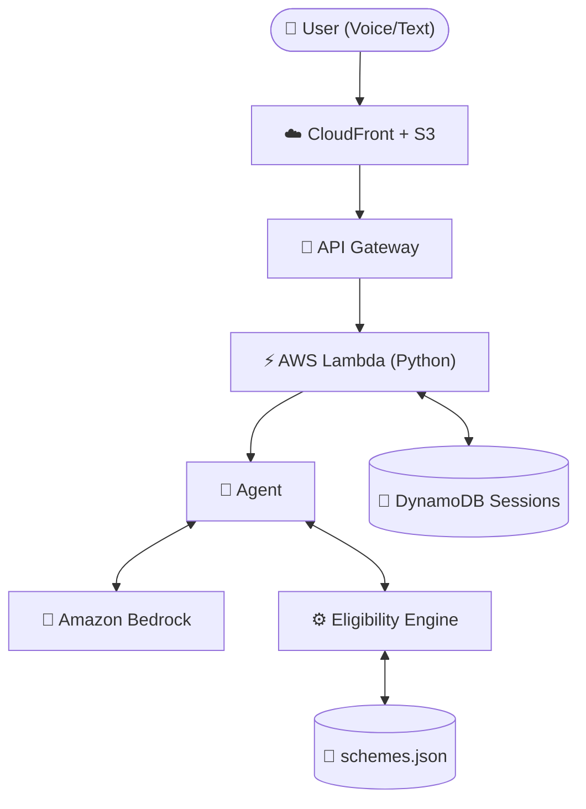

<div align="center">
  
  <h1>Haqdaar — हक़दार</h1>
  <p><em>"Millions of Indian families miss benefits they're entitled to because nobody tells them. Haqdaar tells them in their own language, and never guesses."</em></p>
</div>

---

**Haqdaar** ("rightful claimant") is a mobile-first web app that audits a whole family's eligibility for Indian government schemes. A person describes their family in Hindi or English, by voice or text, and Haqdaar uses a **deterministic rules engine** (never an LLM) to decide eligibility and show exactly what to do next.

Built for the **WeMakeDevs AWS Hackathon**.

## 🌟 Key Features

1. **Deterministic Eligibility**: The LLM extracts facts; a deterministic Python/Cedar engine decides eligibility. Zero hallucinations.
2. **"One Step Away" Intelligence**: Tells you exactly what to do if you narrowly missed a scheme (e.g. "Open a Jan Dhan account, then you qualify").
3. **Voice Native**: Tap the mic and speak in Hindi or English.
4. **Benefits Pack**: Instantly generates a print-optimized PDF with checklists of documents needed.
5. **Mobile-First Glassmorphism UI**: Beautiful, premium, App-like experience built with React, Vite, and Tailwind v4.

## 🏗️ Architecture



### AWS Services Used
| Service | Purpose |
|---|---|
| **Amazon S3 + CloudFront** | Fast, edge-cached static frontend hosting |
| **API Gateway (HTTP API)** | REST API with CORS and rate-throttling |
| **AWS Lambda** | Serverless Python backend execution |
| **Amazon DynamoDB** | 24-hour TTL session storage |
| **Amazon Bedrock** | LLM for conversational fact extraction |
| **AWS SAM** | Infrastructure as Code |

## 🚀 Run Locally

```bash
# 1. Start the Backend (Mock Agent Mode - No AWS required)
cd backend
pip install -r requirements.txt
python local_server.py

# 2. Start the Frontend
cd frontend
npm install
npm run dev
```

Open `http://localhost:5173` and click the mic or type:
> *"I'm a farmer in Rajasthan with a wife, a 7-year-old daughter and a mother aged 68"*

## ☁️ Deploy to AWS

```bash
sam build --use-container
sam deploy --guided
# Follow prompts. Get the ApiUrl from the stack outputs.

# Build and sync frontend
cd frontend
VITE_API_URL=<Your-ApiUrl> npm run build
aws s3 sync dist/ s3://<your-bucket-name> --delete
```

## 🧠 What I Learned
- **Deterministic AI is the future for FinTech/GovTech**: LLMs are terrible at complex numerical eligibility rules. Separating the conversational extraction (Bedrock) from the business logic (Python Engine) made the app 100% reliable.
- **Tailwind v4**: The new CSS-based configuration in Tailwind v4 is a game-changer for maintaining clean frontend code.

## 📜 Limitations & Disclaimer
All scheme rules in this repository are **PROVISIONAL**. This tool provides guidance, not a legal determination. Final eligibility is confirmed by the official office. User sessions auto-expire in 24 hours.

---
<p align="center">Made with ❤️ for WeMakeDevs</p>
